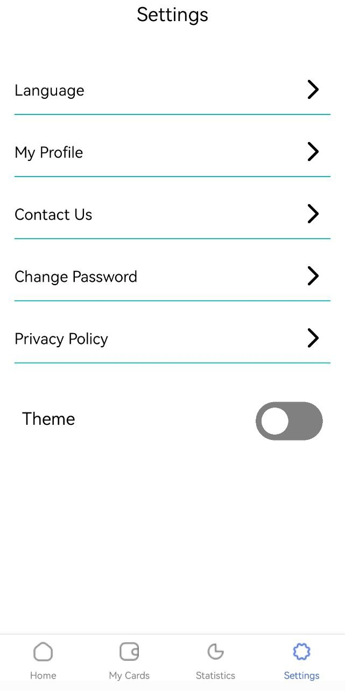
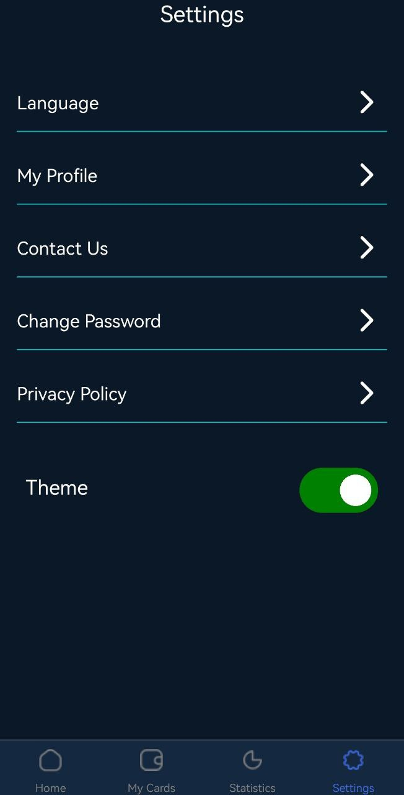

# rn-assignment5-11068463

## Functionality Description

1. **Bottom Tabs:** The bottom tabs were created using the react native bottom tab libray. The labels and custom icons were specified. The active and inactive tab colours were also specifies under the screen options prop of tab navigator.

2. **Theme functionality:** The light annd dark theme was achieved using _useContext_.  The toggle switch on the settings page triggers a function that sets the the theme state accordingly. Text and image components are rendered accordingly depending on the current value of _isDarkTheme_.

3. **Toggle switch:** The toggle switch consists of two view elements whose position and colour change when the component is pressed. The position of the circular slider moves from _flex-start_ to _flex-end_ hence simulating the toggling.

## Project Images

